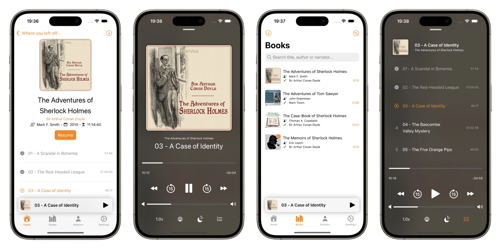

# plappa

plappa is an audiobook player/client for [Jellyfin, the free software media system](https://jellyfin.org), written in Swift/SwiftUI.

Apart from playing audiobooks, plappa also syncs playback status via iCloud and allows you to download audiobooks for offline listening.

It currently runs on iPhone and iPad, a Mac and Apple TV version are planned ([see the roadmap](#roadmap)).

For now, plappa is in a closed TestFlight beta. The public release is set for early 2024.

## About

plappa requires a Jellyfin Server to work. If you don't know Jellyfin and would like to learn more, check out their [website](https://jellyfin.org) or [GitHub repo](https://github.com/jellyfin/jellyfin).

### Folder structure and formats

plappa should be able to handle all common audio file formats, but is built for and tested mainly with MP3 and M4B files.

I always test plappa using the [most common organization scheme for books](https://jellyfin.org/docs/general/server/media/books/), but other folder structures should work fine, plappa just searches for audio files recoursively, grouping by album.

### Metadata

Most metadata will be taken from Jellyfin, plappa additionally reads the `composer` field of the file metadata for the narrator information.

## Roadmap

You can see the full roadmap in the [plappa project](https://github.com/users/LeoKlaus/projects/7/views/2), the short version is:

- [x] iOS App with all basic features
- [ ] Carplay support
- [ ] Apple Watch App
- [ ] Mac App
- [ ] Apple TV App
- [ ] Support for [AudioBookShelf servers](https://www.audiobookshelf.org/)

## Feedback

### Bug reports

If you encounter any issues while using plappa, please [create an issue here on GitHub](https://github.com/LeoKlaus/plappa/issues/new/choose).
Follow the guidelines for creating an issue and provide as much information as possible without revealing any personal data. Please check if a bug has already been reported before creating a new issue.

### Feature requests

Feature requests are managed in [the discussion section of this repo](https://github.com/LeoKlaus/plappa/discussions). You can create feature requests and vote on other ideas [here](https://github.com/LeoKlaus/Paperparrot/discussions/new/choose). Please check if a similar feature has been requested before and vote on that instead of creating a duplicate.
